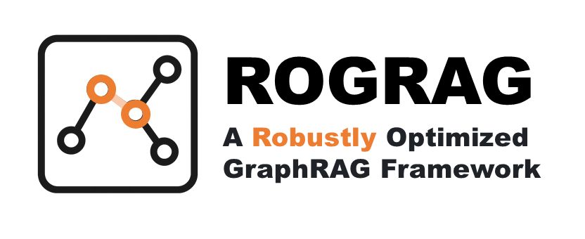

English | [Simplified Chinese](./README_zh_cn.md)

<div align="center">
  
</div>

<div>
  <a href="https://arxiv.org/abs/2503.06474" target="_blank">
    
  </a>
</div>

## 🔥 Introduction

ROGRAG enhances LLM performance on specialized topics using a robust GraphRAG approach. It features a two-stage (dual-level and logic form methods) retrieval mechanism to improve accuracy without extra computation costs. ROGRAG achieves a 15% score boost on [SeedBench](https://github.com/open-sciencelab/SeedBench), outperforming mainstream methods.

This repo has contributed to:

- [GraphGen](https://github.com/open-sciencelab/GraphGen) for better knowledge graph construction
- [SeedLLM Rice](https://www.cell.com/molecular-plant/issue?pii=S1674-2052(24)X0008-8) for online service

<div align="center">
  
</div>

**Key Highlights**:

  - Two-stage retrieval for robustness
  - Incremental database construction
  - Enhanced fuzzy matching and structured reasoning

<div align="center">

| Method          | QA-1 (Accuracy) | QA-2 (F1) | QA-3 (Rouge) | QA-4 (Rouge) |
|-----------------|-----------------|-----------|--------------|--------------|
| vanilla (w/o RAG) | 0.57            | 0.71      | 0.16         | 0.35         |
| LangChain        | 0.68            | 0.68      | 0.15         | 0.04         |
| BM25             | 0.65            | 0.69      | 0.23         | 0.03         |
| RQ-RAG           | 0.59            | 0.62      | 0.17         | 0.33         |
| ROGRAG (Ours)    | **0.75**        | **0.79**  | **0.36**     | **0.38**     |

</div>

Deployed on an online research platform, ROGRAG is ready for integration. [Here](https://arxiv.org/abs/2503.06474) is the technical report.

If it is useful to you, please star it ⭐

## 📖 Documentation
- [1. Run from Docker (CMD / Swagger Server API / Gradio)](docs/en/doc_how_to_run_from_docker.md)
- [2. Run from Source](docs/en/doc_how_to_run.md)
- [3. Directory Structure and Function](docs/en/doc_architecture.md)
- [**FAQ** about environment and error](https://github.com/tpoisonooo/HuixiangDou2/issues/8) 

## 🔆 Version Description

Compared to [HuixiangDou](https://github.com/internlm/huixiangdou), this repo improves accuracy:
1. **Graph Schema**. Dense retrieval is only for querying similar entities and relationships.
2. Ported/merged multiple open-source implementations, with code differences of nearly 18k lines:
   - **Data**. Organized a set of real domain knowledge that LLM has not fully seen for testing (gpt accuracy < 0.6)
   - **Ablation**. Confirmed the impact of different stages and parameters on accuracy

3. API remains compatible. That means Wechat/Lark/Web in v1 is also accessible.
   ```text
   # v1 API https://github.com/InternLM/HuixiangDou/blob/main/huixiangdou/service/parallel_pipeline.py#L290
   async def generate(self,
               query: Union[Query, str],
               history: List[Tuple[str]]=[], 
               language: str='zh', 
               enable_web_search: bool=True,
               enable_code_search: bool=True):
   
   # v2 API https://github.com/tpoisonooo/HuixiangDou2/blob/main/huixiangdou/pipeline/parallel.py#L135
   async def generate(self,
                   query: Union[Query, str],
                   history: List[Pair] = [],
                   request_id: str = 'default',
                   language: str = 'zh_cn'):
   ```
   

## 🍀 Acknowledgements
- [SiliconCloud](https://siliconflow.cn) Abundant LLM API, some models are free
- [KAG](https://github.com/OpenSPG/KAG) Graph retrieval based on reasoning
- [DB-GPT](https://github.com/eosphoros-ai/DB-GPT) LLM tool collection
- [LightRAG](https://github.com/HKUDS/LightRAG) Simple and efficient graph retrieval solution
- [SeedBench](https://github.com/open-sciencelab/SeedBench) A multi-task benchmark for evaluating LLMs in seed science

## 📝 Citation

!!! The impact of open-source on different fields/industries varies. Since licensing restriction, we can **only give the code and test conclusions, and the test data cannot be provided**.

```text
@misc{kong2024huixiangdou,
      title={HuiXiangDou: Overcoming Group Chat Scenarios with LLM-based Technical Assistance},
      author={Huanjun Kong and Songyang Zhang and Jiaying Li and Min Xiao and Jun Xu and Kai Chen},
      year={2024},
      eprint={2401.08772},
      archivePrefix={arXiv},
      primaryClass={cs.CL}
}

@misc{kong2024labelingsupervisedfinetuningdata,
      title={Labeling supervised fine-tuning data with the scaling law}, 
      author={Huanjun Kong},
      year={2024},
      eprint={2405.02817},
      archivePrefix={arXiv},
      primaryClass={cs.CL},
      url={https://arxiv.org/abs/2405.02817}, 
}

@misc{kong2025huixiangdou2robustlyoptimizedgraphrag,
      title={HuixiangDou2: A Robustly Optimized GraphRAG Approach}, 
      author={Huanjun Kong and Zhefan Wang and Chenyang Wang and Zhe Ma and Nanqing Dong},
      year={2025},
      eprint={2503.06474},
      archivePrefix={arXiv},
      primaryClass={cs.IR},
      url={https://arxiv.org/abs/2503.06474}, 
}
```
