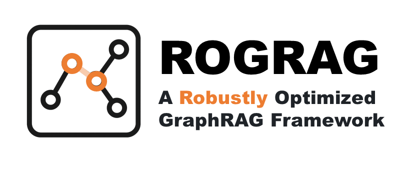

[English](./README.md) | 简体中文

<div align="center">

</div>

<div>
  <a href="https://arxiv.org/abs/2503.06474" target="_blank">
    
  </a>
</div>

## 🔥 简介

GraphRAG 有很多参数要调整，大语言模型（LLM）训练集也有 RAG 测试数据。LLM input token 影响生成概率（phi-4技术报告、[《当我谈RAG时我谈些什么》](https://link.zhihu.com/?target=https%3A//fatescript.github.io/blog/2024/LLM-RAG/)）。这些导致无法明确 LLM response 精度提升来源是 Key Token 还是检索 pipeline。

ROGRAG 合并多个开源项目——HuixiangDou、KAG、LightRAG 和 DB-GPT，总计 18k 行代码，并在 `Qwen2.5-7B-Instruct` 表现不佳的测试集上进行了对比实验。分数从 60 涨到 ~75。 最终融出一个运行效果得到人类领域专家认可的 GraphRAG 实现。[这里](https://arxiv.org/abs/2503.06474)是技术报告。

<div align="center">
  
</div>

特点:

  - 两阶段检索，强化模糊匹配和逻辑推理检索
  - 增量式建知识库

<div align="center">

| Method          | QA-1 (Accuracy) | QA-2 (F1) | QA-3 (Rouge) | QA-4 (Rouge) |
|-----------------|-----------------|-----------|--------------|--------------|
| vanilla (w/o RAG) | 0.57            | 0.71      | 0.16         | 0.35         |
| LangChain        | 0.68            | 0.68      | 0.15         | 0.04         |
| BM25             | 0.65            | 0.69      | 0.23         | 0.03         |
| RQ-RAG           | 0.59            | 0.62      | 0.17         | 0.33         |
| ROGRAG (Ours)    | **0.75**        | **0.79**  | **0.36**     | **0.38**     |

</div>

如果对你有用，麻烦 star 一下⭐

## 💡 更新
- [2025/11] 支持多数据库，重构 Gradio UI 和 server

## 📖 文档

- [1. docker运行（命令行、Swagger API、Gradio 方式）](docs/zh_cn/doc_how_to_run_from_docker.md)
- [2. 源码运行](docs/zh_cn/doc_how_to_run.md)
- [3. 目录结构功能](docs/zh_cn/doc_architecture.md)
- [环境、报错 **FAQ**](https://github.com/tpoisonooo/HuixiangDou2/issues/8)

## 🔆 版本说明

与 [HuixiangDou](https://github.com/internlm/huixiangdou) 相比，ROGRAG 专注提升精度：

1. **图谱方案**。稠密计算仅用于查询近似实体和关系
2. 移植/合并多个开源实现，代码差异 ~18k 行

    - **数据**。整理一套 LLM 未完全见过的、真实领域知识作测试（gpt 准确度低于 0.6）
    - **消融**。确认不同环节和参数对精度的影响

3. 版本间的 API 保持兼容。v1 的微信、飞书、 Web 前后端、[readthedocs](https://huixiangdou.readthedocs.io/zh-cn/latest/) 都可以用。具体入参对比：
   ```text
   # v1 API https://github.com/InternLM/HuixiangDou/blob/main/huixiangdou/service/parallel_pipeline.py#L290
   async def generate(self,
               query: Union[Query, str],
               history: List[Tuple[str]]=[], 
               language: str='zh', 
               enable_web_search: bool=True,
               enable_code_search: bool=True):
   
   # v2 API https://github.com/tpoisonooo/HuixiangDou2/blob/main/huixiangdou/pipeline/parallel.py#L135
   async def generate(self,
                   query: Union[Query, str],
                   history: List[Pair] = [],
                   request_id: str = 'default',
                   language: str = 'zh_cn'):
   ```

   *  history item 从 `Tuple` 改 `Pair`，是因为二代支持 [Swagger API](./docs/swagger.json)，类似知乎直答的效果
   *  language 从 `zh` 改 `zh_cn`，因为中文本来就有简繁两版
   *  enable_web_search 和 enable_code_search 放进 `query` 里。设计上更合理
   *  request_id 是考虑日志级别，每个 request 的日志应该记录进不同文件，而不是所有用户的处理日志糊到一起
   

## 🍀 致谢
- [SiliconCloud](https://siliconflow.cn/zh-cn/siliconcloud)    海量 LLM API，部分模型免费
- [KAG](https://github.com/OpenSPG/KAG)    基于推理的图谱检索
- [DB-GPT](https://github.com/eosphoros-ai/DB-GPT)    LLM 工具集合体
- [LightRAG](https://github.com/HKUDS/LightRAG)    简单高效的图谱检索方案
- [SeedBench](https://github.com/open-sciencelab/SeedBench)    育种行业 LLM（垂域）评测集
- [kimi-cli](https://github.com/MoonshotAI/kimi-cli) 基于 kimi 的 AI 编程工具

## 📝 引用

开源这件事本身，对不同领域/行业的影响各不相同。我们只能提供代码和测试结论，**无法提供测试数据**。

```text
@misc{kong2024huixiangdou,
      title={HuiXiangDou: Overcoming Group Chat Scenarios with LLM-based Technical Assistance},
      author={Huanjun Kong and Songyang Zhang and Jiaying Li and Min Xiao and Jun Xu and Kai Chen},
      year={2024},
      eprint={2401.08772},
      archivePrefix={arXiv},
      primaryClass={cs.CL}
}

@misc{kong2024labelingsupervisedfinetuningdata,
      title={Labeling supervised fine-tuning data with the scaling law}, 
      author={Huanjun Kong},
      year={2024},
      eprint={2405.02817},
      archivePrefix={arXiv},
      primaryClass={cs.CL},
      url={https://arxiv.org/abs/2405.02817}, 
}

@misc{kong2025huixiangdou2robustlyoptimizedgraphrag,
      title={HuixiangDou2: A Robustly Optimized GraphRAG Approach}, 
      author={Huanjun Kong and Zhefan Wang and Chenyang Wang and Zhe Ma and Nanqing Dong},
      year={2025},
      eprint={2503.06474},
      archivePrefix={arXiv},
      primaryClass={cs.IR},
      url={https://arxiv.org/abs/2503.06474}, 
}
```
